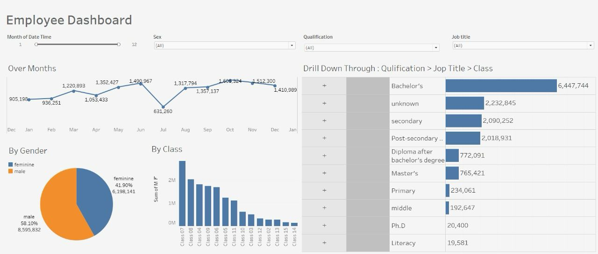

# Employee Behavior Analysis

## 📊 Dashboard Preview

---

## 📊 Project Overview
This project focuses on analyzing employee attendance data to uncover patterns, trends, and insights related to employee behavior.

The analysis helps in understanding attendance consistency, identifying absenteeism patterns, and supporting data-driven decision making.

---

## 🎯 Objectives
- Analyze employee attendance patterns  
- Detect absenteeism trends  
- Identify behavior insights from data  
- Visualize key findings  

---

## 📊 Dashboard
Developed an interactive Tableau dashboard to present key insights from employee attendance data.

Features:
- Time-based trend analysis (monthly attendance)
- Gender distribution visualization  
- Employee classification breakdown  
- Drill-down functionality (Qualification → Job Title → Class)  

---

## 🛠️ Tools & Technologies
- Python  
- Pandas  
- Matplotlib  
- Tableau  

---

## 📁 Project Structure
- employee_behavior_analysis.ipynb → Data analysis notebook  
- employee_attendance_dashboard.twb → Tableau dashboard file  
- employee_attendance_dashboard.png → Dashboard preview  

---

## 🔍 Key Analysis Performed
- Data cleaning and preprocessing  
- Exploratory Data Analysis (EDA)  
- Data aggregation and grouping using Pandas  
- Visualization of trends and patterns  
- Dashboard creation using Tableau  

---

## ▶️ How to Run
1. Open the notebook using:
   - Jupyter Notebook OR
   - Google Colab  
2. Run all cells step by step  
3. Open the Tableau file to explore the dashboard  

---

## 📊 Results
The project demonstrates how data analysis can be used to:
- Understand employee attendance behavior  
- Highlight patterns and trends  
- Support decision-making using data  

---

## 📂 Dataset
The original dataset is not included in this repository due to privacy and confidentiality reasons.

---

## 👩‍💻 Author
Elham Khatim  
Data Analyst | Data Science Graduate
